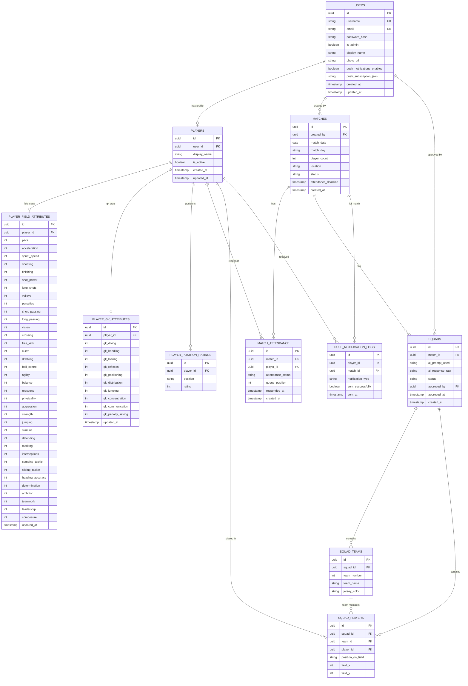
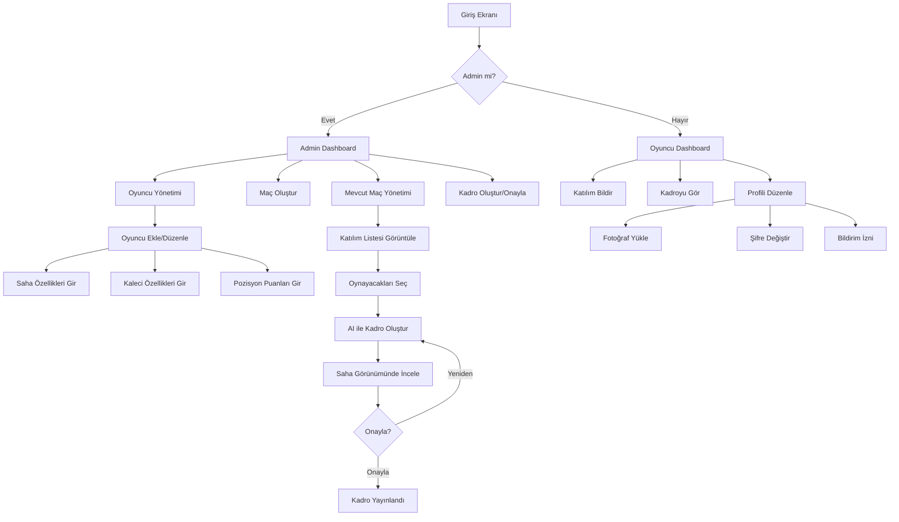

# ⚽ Halı Saha Yönetim Uygulaması

Next.js tabanlı, yapay zeka destekli haftalık halı saha maç yönetim platformu.

---

## 📋 İçindekiler

- [Teknoloji Seçimleri](#teknoloji-seçimleri)
- [Özellikler](#özellikler)
  - [1. Futbolcu Yönetimi](#1-futbolcu-yönetimi)
  - [2. Haftalık Maç Yönetimi](#2-haftalık-maç-yönetimi)
  - [3. Katılım & Kadro Oluşturma](#3-katılım--kadro-oluşturma)
- [Kullanıcı Rolleri](#kullanıcı-rolleri)
- [Veritabanı Şeması](#veritabanı-şeması)
- [Ekran Akışı](#ekran-akışı)
- [Kurulum](#kurulum)


---

## 🛠 Teknoloji Seçimleri

| Katman | Teknoloji | Neden |
|---|---|---|
| Framework | Next.js 14 (App Router) | SSR + API Routes birlikte |
| Dil | TypeScript | Tip güvenliği |
| Stil | Tailwind CSS | Hızlı geliştirme |
| Veritabanı | **Supabase (PostgreSQL)** | Ücretsiz, sıfır kurulum, auth dahil |
| Auth | Supabase Auth | Kullanıcı yönetimi hazır gelir |
| AI | Google Gemini 2.0 Flash (**Ücretsiz**) | Kadro oluşturma için |
| Deploy | Vercel (GitHub entegrasyonu) | GitHub'dan otomatik deploy |
| Bildirimler | Web Push API (PWA) | Chrome bildirimleri |
| Fotoğraf | Supabase Storage | Dosya depolama |

> **Neden Supabase?** — Bir hesap açıp proje oluşturunca connection string hazır. Hiçbir server veya Docker kurulumu gerekmez. Ücretsiz tier bu uygulama için fazlasıyla yeterli. Vercel'e deploy edince GitHub'dan otomatik CI/CD çalışır.
>
> **Neden Gemini?** — Google AI Studio üzerinden API key alınır, aylık 1,500 istek ve 1M token/dakika limiti tamamen **ücretsiz**. Haftalık 1-2 kadro oluşturma için fazlasıyla yeterli, hiçbir ücret ödemeden kullanılır.

---

## 🎯 Özellikler

### 1. Futbolcu Yönetimi

Her futbolcunun sisteme hem **saha oyuncusu** hem **kaleci** özellikleri girilebilir. Farklı maçlarda farklı pozisyonlarda oynayabilirler.

#### 🏃 Saha Oyuncusu Özellikleri (0–99)

| Kategori | Özellik | Açıklama |
|---|---|---|
| **Hız** | Hız (`pace`) | Genel hız puanı |
| **Hız** | İvme (`acceleration`) | Hızlanma kabiliyeti |
| **Hız** | Sprint Hızı (`sprint_speed`) | Maksimum koşu hızı |
| **Şut** | Şut (`shooting`) | Genel şut puanı |
| **Şut** | Bitiricilik (`finishing`) | Gol pozisyonlarını değerlendirme |
| **Şut** | Şut Gücü (`shot_power`) | Vuruş sertliği |
| **Şut** | Uzaktan Şut (`long_shots`) | Uzak mesafe vuruşlar |
| **Şut** | Vole (`volleys`) | Havada vuruş |
| **Şut** | Penaltı (`penalties`) | Penaltı atışı |
| **Pas** | Kısa Pas (`short_passing`) | Yakın mesafe pas isabeti |
| **Pas** | Uzun Pas (`long_passing`) | Uzak mesafe pas isaabeti |
| **Pas** | Vizyon (`vision`) | Orkestra kurma, asist |
| **Pas** | Orta (`crossing`) | Kanat ortaları |
| **Pas** | Frikik (`free_kick`) | Serbest vuruşlar |
| **Pas** | Eğri (`curve`) | Toplara efekt katma |
| **Çalım** | Çalım (`dribbling`) | Genel top sürme puanı |
| **Çalım** | Top Kontrolü (`ball_control`) | Topu ayakta tutma |
| **Çalım** | Çeviklik (`agility`) | Anlık yön değiştirme |
| **Çalım** | Denge (`balance`) | Top sürme dengesi |
| **Çalım** | Reaksiyon (`reactions`) | Anlık karar verme |
| **Fizik** | Fizik (`physicality`) | Genel fizik puanı |
| **Fizik** | Mücadele (`aggression`) | Fiziksel mücadeleye girme |
| **Fizik** | Güç (`strength`) | Vücut gücü |
| **Fizik** | Zıplama (`jumping`) | Hava topu |
| **Fizik** | Kondisyon (`stamina`) | Maç boyunca tempo koruma |
| **Defans** | Defans (`defending`) | Genel defans puanı |
| **Defans** | Markaj (`marking`) | Adam markajı |
| **Defans** | Top Kapma (`interceptions`) | Araya girme |
| **Defans** | Hücuma Müdahale (`standing_tackle`) | Ayakta top çalma |
| **Defans** | Kayarak Müdahale (`sliding_tackle`) | Kayarak top çalma |
| **Kafa** | Kafa Vuruşu (`heading_accuracy`) | Kafa isabeti |
| **Zihin** | Azim (`determination`) | Pes etmeme |
| **Zihin** | Hırs (`ambition`) | Kazanma isteği |
| **Zihin** | Takım Oyunu (`teamwork`) | Takım için koşma |
| **Zihin** | Liderlik (`leadership`) | Takımı sürükleme |
| **Zihin** | Baskıya Dayanıklılık (`composure`) | Gergin anlarda sakinlik |

#### 🥅 Kaleci Özellikleri (0–99)

| Özellik | Açıklama |
|---|---|
| Dalış (`gk_diving`) | Köşelere uzanma |
| Yakalama (`gk_handling`) | Topu kavrama |
| Kale Vuruşu (`gk_kicking`) | Kalecinin topu uzağa atması |
| Refleksler (`gk_reflexes`) | Ani kurtarışlar |
| Yerleşim (`gk_positioning`) | Kale içinde doğru konumlanma |
| Dağıtım (`gk_distribution`) | Çıkışları yönetme |
| Zıplama (`gk_jumping`) | Havada çıkış |
| Konsantrasyon (`gk_concentration`) | Uzun süre dikkatli kalma |
| İletişim (`gk_communication`) | Savunmayı yönetme |
| Penaltı Kurtarma (`gk_penalty_saving`) | Penaltı kurtarma becerisi |

#### 📍 Pozisyon Değerlendirmeleri

Her oyuncu birden fazla pozisyon için ayrı puan alabilir:

| Pozisyon | Kod | Açıklama |
|---|---|---|
| Kaleci | GK | Kale alanı |
| Sol Bek | LB | Sol kanat defans |
| Sağ Bek | RB | Sağ kanat defans |
| Stoper | CB | Orta defans |
| Defansif Orta | CDM | Orta saha önü defans |
| Sol Kanat Orta | LM | Sol orta saha |
| Orta Saha | CM | Orta saha |
| Sağ Kanat Orta | RM | Sağ orta saha |
| Sol Açık | LW | Sol kanat hücum |
| Sağ Açık | RW | Sağ kanat hücum |
| Ofansif Orta | CAM | 10 numara |
| İkinci Forvet | CF | Forvet arkası |
| Santrafor | ST | Golcü forvet |

---

### 2. Haftalık Maç Yönetimi

#### Maç Oluşturma (Admin)
- Maç günü seç (Pazartesi–Pazar)
- Oynayacak kişi sayısı gir (örn: 10 = 5'e 5, 14 = 7'ye 7)
- Maç konumu / sahası (opsiyonel not)

#### Katılım Bildirimi
- Mevcut maç biter → otomatik olarak **bir sonraki maç** için katılım ekranı açılır
- **Son katılım saati:** Maçtan bir gün önce saat **17:00**
- Sisteme kayıtlı tüm oyuncular katılım ekranını görür
- Her oyuncu **"Katılıyorum"** veya **"Katılmıyorum"** seçeneğini işaretler
- Katılım sırası → kayıt zamanına göre listeye eklenir

#### Push Bildirimleri (Chrome / PWA)
- Kullanıcı izin verdiyse → bildirim aboneliği kaydedilir
- Maçtan 2 gün önce **saat 12:00** ve 1 gün önce **saat 14:00** → "Henüz oy vermediniz!" bildirimi gönderilir (sadece oy vermeyenlere)
- Cron job: Vercel Cron veya Supabase Edge Functions ile

---

### 3. Katılım & Kadro Oluşturma

#### Katılım Listesi
- Tüm kullanıcılar katılan oyuncuların sıralı listesini görür
- Liste: Sıra No | Fotoğraf | İsim | Pozisyon(lar) | Kayıt Zamanı
- Fazla başvuru varsa → yedek listesi görünür (sıra numarası ile)

#### Kadro Oluşturma (Admin)
1. Admin **"Kadro Oluştur"** butonuna tıklar
2. Fazla katılımcı varsa → oynayacak `N` kişiyi seçer (checkbox ile)
3. Seçilen oyuncuların tüm özellikleri OpenAI GPT-4o API'ye gönderilir
4. AI aşağıdaki kriterlere göre **2 dengeli takım** oluşturur:
   - Her takımda gerekli pozisyonlar dolu olmalı (GK + defans + orta + forvet)
   - Takımların genel puanları mümkün olduğunca eşit
   - Oyuncunun en iyi pozisyonu önceliklendirilir
   - Kaleci olan varsa mutlaka kaleye konur
5. Sonuç ekranda **futbol sahası** üzerinde HTML/CSS ile görünür
   - Her oyuncunun üzerine gelinince → önemli özellikleri **tooltip popup** ile görünür
   - Popup'ta: Pas, Şut, Hız, Çalım, Defans, Kondisyon ve oyuncunun fotoğrafı

#### Kadro Onayı
- Admin kadroyu inceler
- **"Onayla"** butonuna basarsa → kadro kaydedilir ve herkes tarafından görünür hale gelir
- **"Yeniden Oluştur"** butonuna basarsa → AI tekrar prompt çalıştırır
- Onaylanan kadrolar değiştirilemez (arşive gider)

#### Forma Renkleri
Admin her takım için forma rengi seçer:

| Renk | Kod |
|---|---|
| Beyaz | `#FFFFFF` |
| Siyah | `#1a1a1a` |
| Kırmızı | `#e63946` |
| Mavi | `#1d6fa4` |
| Sarı | `#f4d03f` |
| Yeşil | `#2ecc71` |
| Turuncu | `#e67e22` |
| Mor | `#8e44ad` |

---

## 👥 Kullanıcı Rolleri

### Admin
- Oyuncu ekle / düzenle / sil
- Kullanıcı hesabı oluştur (username + geçici şifre)
- Maç oluştur
- Katılım listesinden oynayacakları seç
- Kadro oluştur / onayla
- Forma rengi seç

### Oyuncu (Kullanıcı)
- Kendi profilini görüntüle (özellikler adminden gelir, oyuncu göremez — isteğe bağlı)
- Şifre değiştir
- Profil fotoğrafı yükle
- Katılım bildirimi ver
- Katılım listesini gör
- Onaylanan kadroları gör

---

## 🗄 Veritabanı Şeması



---

## 🔄 Uygulama Ekran Akışı



---

## 📁 Önerilen Klasör Yapısı

```
pitch-manager/
├── src/
│   ├── app/
│   │   ├── (auth)/
│   │   │   ├── login/
│   │   │   └── change-password/
│   │   ├── (dashboard)/
│   │   │   ├── layout.tsx
│   │   │   ├── dashboard/
│   │   │   ├── matches/
│   │   │   │   ├── [id]/
│   │   │   │   │   ├── attendance/
│   │   │   │   │   └── squad/
│   │   │   ├── players/
│   │   │   └── profile/
│   │   ├── api/
│   │   │   ├── auth/
│   │   │   ├── matches/
│   │   │   ├── players/
│   │   │   ├── squads/
│   │   │   │   └── generate/    ← AI kadro endpoint
│   │   │   └── notifications/
│   │   │       └── cron/        ← Push bildirim cron
│   │   ├── globals.css
│   │   └── layout.tsx
│   ├── components/
│   │   ├── football-field/      ← SVG saha + oyuncu yerleşimi
│   │   ├── player-card/
│   │   ├── attendance-list/
│   │   ├── squad-builder/
│   │   └── ui/
│   ├── lib/
│   │   ├── supabase/
│   │   │   ├── client.ts
│   │   │   └── server.ts
│   │   ├── openai/
│   │   │   └── squad-generator.ts
│   │   └── push-notifications/
│   ├── types/
│   └── utils/
├── supabase/
│   └── migrations/              ← SQL migration dosyaları
├── public/
└── .env.local.example
```

---

## ⚙️ Ortam Değişkenleri (.env.local)

```env
# Supabase
NEXT_PUBLIC_SUPABASE_URL=https://xxxx.supabase.co
NEXT_PUBLIC_SUPABASE_ANON_KEY=xxxx
SUPABASE_SERVICE_ROLE_KEY=xxxx

# Google Gemini (Ücretsiz → https://aistudio.google.com/apikey)
GOOGLE_GEMINI_API_KEY=your-api-key

# Web Push
NEXT_PUBLIC_VAPID_PUBLIC_KEY=xxxx
VAPID_PRIVATE_KEY=xxxx
VAPID_SUBJECT=mailto:admin@example.com

# App
NEXT_PUBLIC_APP_URL=https://halisaha.yourdomain.com
```

---

## 🚀 Kurulum (Geliştirme Ortamı)

```bash
# 1. Repoyu klonla
git clone https://github.com/kullanici/pitch-manager.git
cd pitch-manager

# 2. Bağımlılıkları yükle
npm install

# 3. Supabase projesi oluştur → https://supabase.com
# 4. .env.local dosyasını oluştur ve değerleri doldur
cp .env.local.example .env.local

# 5. Migration'ları çalıştır (Supabase Dashboard > SQL Editor)

# 6. Geliştirme sunucusunu başlat
npm run dev
```

---

## 🎨 UI/UX Tasarım Rehberi

### Genel Tema
- **Arkaplan:** Koyu lacivert/siyah `#0a0e1a` — FIFA / futbol oyunu estetiği
- **Kart arkaplanı:** `#111827` → `#1a2235` gradyanları
- **Vurgu:** Yeşil `#22c55e` (çim), Altın `#eab308` (yıldız oyuncular)
- **Font:** Geist / Inter — modern, temiz

### ⬡ Oyuncu Özellik Grafikleri (FIFA Stilinde)

**Radar / Hexagon Chart (SVG — kütüphane gerektirmez)**
- **Saha oyuncusu:** 6 ana kategori → PAC · SHO · PAS · DRI · DEF · PHY
- **Kaleci:** 5 ana kategori → DIV · HAN · KIC · REF · POS
- SVG polygon ile çizilir; her değer 0-99 arasını koordinata dönüştürür
- Dolgu renk skalası: 0-59 → kırmızı, 60-74 → sarı, 75-89 → yeşil, 90-99 → altın
- Köşelerde kategori etiketi + sayısal değer gösterilir

**Detaylı Özellik Listesi (Kategorilere Göre)**
- Her özellik için: İsim | Animasyonlu progress bar | Sayısal değer
- Progress bar rengi değere göre değişir (FIFA OVR renk sistemi)
- Kategoriler açılıp kapanabilir (accordion)

### 🏟️ Futbol Sahası Görselleştirme (SVG)
- **Zemin:** Koyu/açık yeşil şeritli gerçek çim efekti
- **Çizgiler:** Merkez daire, penaltı alanları, kale sahaları, köşe yayları — beyaz
- **Oyuncu tokeni:** Yuvarlak; profil fotoğrafı varsa fotoğraf, yoksa baş harf
- **Takım rengi:** Token kenarında kalın renkli border
- **Hover / tap:** Mini popup → isim, 6 temel özellik, genel puan
- Popup sahadan taşmayacak şekilde dinamik konumlanır
- **Takım 1** sahının alt yarısı, **Takım 2** üst yarısı
- Oyuncular pozisyonlarına animasyonla (CSS transition) yerleşir
- **Pozisyon etiketi** tokenin altında görünür (ör: ST, CB, GK)

### 🃏 FIFA Tarzı Oyuncu Kartı
- Üst yarı: Gradyan arka plan + oyuncu fotoğrafı
- OVR puanı büyük fontla sol üst köşede
- 6 temel stat kart üzerinde compact görünümde
- Kart tıklandığında detay modal açılır: radar chart + tam özellik listesi

### 📋 Katılım Ekranı
- Kart bazlı liste: fotoğraf + isim + pozisyonlar + sıra numarası
- Katılım toggle: yeşil (Katılıyorum) / kırmızı (Katılmıyorum) — animasyonlu
- Deadline sayacı — kalan saat ve dakika
- Yedek listesi ayrı seksiyonda, soluk renk tonu ile

### 🖥️ Admin Dashboard
- İstatistik kartları: Toplam oyuncu / Bu haftaki maç / Katılım oranı
- Son aktivite akışı
- Maç takvimi

---

## 🤖 AI Kadro Oluşturma Prompt Şablonu

```
Sen bir futbol antrenörüsün. Aşağıda {N} oyuncunun özellikleri var.
Bu oyunculardan 2 dengeli takım oluştur.

Kurallar:
- Her takımda {N/2} oyuncu olmalı
- En az 1 kaleci her takımda (varsa)
- Takımların toplam genel puanları birbirine mümkün olduğunca yakın olmalı
- Her oyuncu en iyi pozisyonuna yerleştirilmeli
- Saha formatı: {format} (örn: 5v5, 7v7)

Oyuncu listesi:
{player_data_json}

Yanıtı JSON formatında ver:
{
  "team1": [
    { "playerId": "...", "playerName": "...", "position": "ST", "x": 50, "y": 10 }
  ],
  "team2": [...],
  "balance_score": 94.5,
  "notes": "..."
}
```

---

## 📌 Notlar

- **GitHub Pages yerine Vercel kullan** — API routes ve cron joblar için sunucu gereklidir. Vercel ücretsiz tier bu uygulama için yeterli. GitHub reposuna push edince otomatik deploy olur.
- **Supabase ücretsiz tier limitleri:** 500MB DB, 1GB storage, 50k aktif kullanıcı/ay — küçük grup için fazlasıyla yeterli.
- **Google Gemini ücretsiz tier:** Günlük 1,500 istek ve dakikada 1M token — haftalık 1-2 kadro oluşturma için tamamen ücretsiz. API key → [https://aistudio.google.com/apikey](https://aistudio.google.com/apikey)
